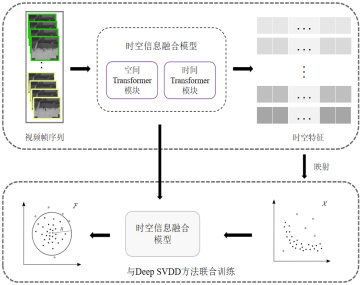

# Model
Implementation of [基于Transformer架构的端到端视频异常检测方法].



## Usage:

### Install:
- Create a conda virtual environment and activate it:

```bash
conda create -n swin python=3.7 -y
conda activate swin
```

- Install `CUDA==10.1` with `cudnn7` following
  the [official installation instructions](https://docs.nvidia.com/cuda/cuda-installation-guide-linux/index.html)
- Install `PyTorch==1.7.1` and `torchvision==0.8.2` with `CUDA==10.1`:

```bash
conda install pytorch==1.7.1 torchvision==0.8.2 cudatoolkit=10.1 -c pytorch
```

- Install `timm==0.3.2`:

```bash
pip install timm==0.3.2
```

- Install other requirements:

```bash
pip install opencv-python==4.4.0.60 termcolor==1.1.0 yacs==0.1.8
```

### Data preparation
We use standard UCSDPed2 dataset, you can download it from : http://visal.cs.cityu.edu.hk/downloads/

### Training model

To train model on UCSDPed2 dataset from scratch, run:

```
python main.py
```

## Acknowledgement:
* Base Deep-SVDD code is borrowed from : https://github.com/lukasruff/Deep-SVDD-PyTorch
* Base ViViT Model is from : https://kgithub.com/rishikksh20/ViViT-pytorch
* Base Swin Transformer Model is from : https://kgithub.com/microsoft/Swin-Transformer
* Swin Transformer Pretrained Models on ImageNet
[github](https://github.com/SwinTransformer/storage/releases/download/v1.0.0/swin_tiny_patch4_window7_224.pth)
